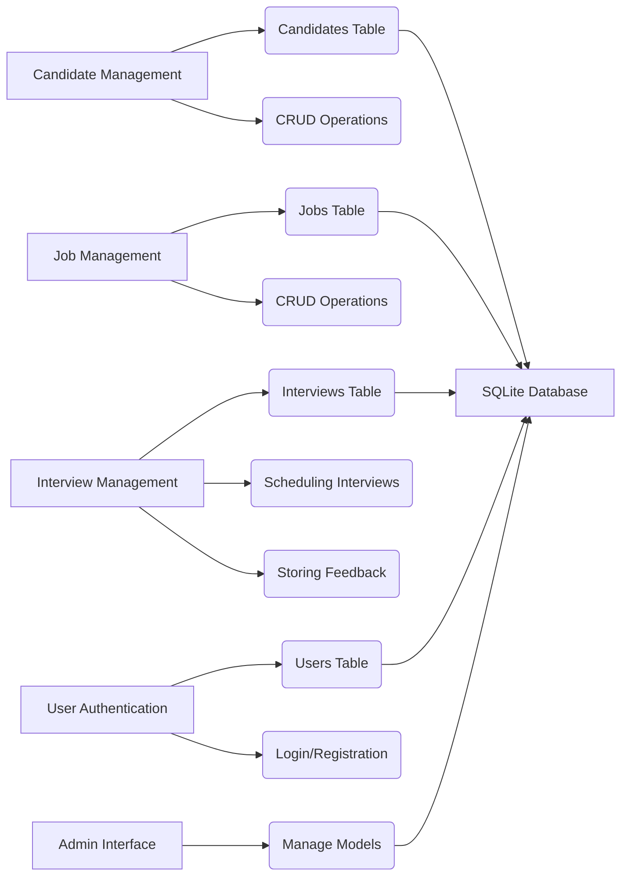

# System Architecture Plan

**1. Core Features:**

*   Candidate Tracking: Manage candidate profiles, track application status, and store resumes.
*   Job Posting Management: Create and manage job postings, and track applications per job.
*   Interview Scheduling: Schedule interviews with candidates and manage interview feedback.
*   User Authentication: Secure the system with user accounts and login functionality.
*   Admin Interface: A basic interface to manage users, candidates, jobs, and interviews.

**2. Technology Stack:**

*   Backend: Python/Django
*   Database: SQLite (for simplicity)
*   Frontend: Basic HTML/CSS/JavaScript (or Django templates for simplicity)

**3. Database Schema (SQLite):**

*   **Candidates Table:**
    *   candidate\_id (INTEGER PRIMARY KEY AUTOINCREMENT)
    *   first\_name (TEXT)
    *   last\_name (TEXT)
    *   email (TEXT)
    *   phone (TEXT)
    *   resume (TEXT)
    *   application\_date (DATE)
*   **Jobs Table:**
    *   job\_id (INTEGER PRIMARY KEY AUTOINCREMENT)
    *   title (TEXT)
    *   description (TEXT)
    *   location (TEXT)
    *   posting\_date (DATE)
*   **Interviews Table:**
    *   interview\_id (INTEGER PRIMARY KEY AUTOINCREMENT)
    *   candidate\_id (INTEGER)
    *   job\_id (INTEGER)
    *   interview\_date (DATETIME)
    *   interviewer (TEXT)
    *   feedback (TEXT)
*   **Users Table:**
    *   user\_id (INTEGER PRIMARY KEY AUTOINCREMENT)
    *   username (TEXT UNIQUE)
    *   password (TEXT)
    *   email (TEXT)
    *   is\_staff (BOOLEAN DEFAULT 0)  # For admin access

**4. Modules:**

*   **Candidate Management:**
    *   Create, read, update, and delete (CRUD) operations for candidates.
    *   Resume parsing and storage.
*   **Job Management:**
    *   CRUD operations for job postings.
    *   Application tracking per job.
*   **Interview Management:**
    *   Scheduling interviews.
    *   Storing interview feedback.
*   **User Authentication:**
    *   User registration and login.
    *   Password management.
    *   User roles and permissions (basic).
*   **Admin Interface:**
    *   Django admin panel for managing models.

**5. Workflow:**

1.  **Setup Django Project:**
    *   Create a new Django project and app.
    *   Configure the database settings for SQLite.
2.  **Define Models:**
    *   Create Django models for Candidates, Jobs, Interviews, and Users based on the database schema.
3.  **Implement Views:**
    *   Implement Django views for each module to handle CRUD operations and user authentication.
4.  **Create Templates:**
    *   Create basic HTML templates for the frontend, including login and registration pages.
5.  **Connect URLs:**
    *   Define URL patterns to map URLs to views.
6.  **Register Models in Admin:**
    *   Register the models in `admin.py` to enable the Django admin interface.
7.  **Create Superuser:**
    *   Create a superuser account to access the admin interface.
8.  **Test:**
    *   Test each module to ensure it functions correctly, including user authentication and the admin interface.

**6. Project Structure:**

After setting up the Django project and app, the directory structure is as follows:

```
.
├── .venv/              # Python virtual environment
├── ats_crm_project/    # Django project directory
│   ├── __init__.py
│   ├── settings.py     # Project settings
│   ├── urls.py         # Project URL configurations
│   └── wsgi.py         # WSGI entry point for the project
├── tracking_app/       # Django app directory
│   ├── migrations/     # Database schema migrations
│   ├── __init__.py
│   ├── admin.py        # Admin site configurations
│   ├── apps.py         # App configuration
│   ├── models.py       # Database models
│   ├── tests.py        # App tests
│   └── views.py        # View functions
└── manage.py           # Django management utility
```

**7. Mermaid Diagram:**



**8. Next Steps:**

*   Set up the Django project and app.
*   Define the models in `models.py`.
*   Create the views in `views.py`.
*   Create the templates in the `templates` directory.
*   Connect the URLs in `urls.py`.
*   Register the models in `admin.py`.
*   Create a superuser.